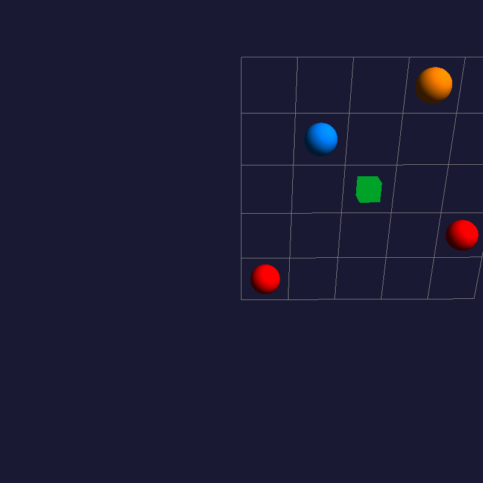

# Reinforcement_Learning_Summative


## Demo




A reinforcement learning environment for simulating bank fraud detection scenarios, 
where an agent patrols a grid to intercept fraudsters attempting to breach ATMs.


├── environment/

│ ├── custom_env.py # Custom Gymnasium environment implementation

│ ├── rendering.py # Visualization components using PyOpenGL

├── training/

│ ├── dqn_training.py # Training script for DQN using SB3
|
│ ├── pg_training.py # Training script for PPO/other PG using SB3
|
├── models/
|
│ ├── dqn/ # Saved DQN models
|
│ └── pg/ # Saved policy gradient models
|
├── main.py # Entry point for running experiments
|
├── requirements.txt # Project dependencies

## Prerequisites

- Python 3.8 or higher
- pip package manager

## Installation

1. Clone the repository:
   ```bash
   git clone https://github.com/yourusername/bank-fraud-rl.git
   cd bank-fraud-rl


Create and activate a virtual environment

python -m venv venv

source venv/bin/activate  # On Windows use `venv\Scripts\activate`

# Install the required dependencies

pip install -r requirements.txt

# Running the Project

# Training the Agent
DQN Training:

python training/dqn_training.py

# Policy Gradient (PPO) Training:

python training/pg_training.py


# Running Experiments

Use the main entry point to run different experiments:

python main.py


Configuration
The environment parameters can be modified in environment/custom_env.py:

Grid size

Number of ATMs

Fraudster spawn rates

Reward structure

Episode length

Dependencies
Main dependencies:

Python 3.8+

Gymnasium

Stable-Baselines3

PyOpenGL

NumPy

Matplotlib (for visualization)

See requirements.txt for the complete list.

Contributing

Contributions are welcome! Please open an issue or submit a pull request for any improvements.

